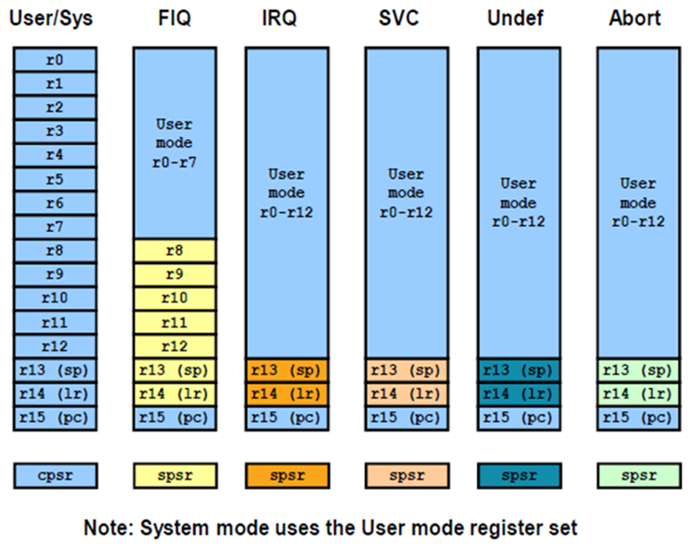

### Registers

User Mode 
--------
There are general purpose registers (Core registers) as well as special purpose register.
R0 - R12 : general purpose registers
R13 (SP) : Stack pointer 
R14 (LR) : Link Register (store the return address when a subroutine call is made )
R15 (PC) : program Counter

One Application Program Status Register (APSR).

Status Registers
----------------
CPSR ( Current Processor Status Register )
 - includes various conditional code flags, Interrupt Status Processor mode and other status and control information.

SPSR ( Saved Processor Status Register )
- In the exception modes there is an additional Saved  Processor Status register (SPSR) which holds information on the processor’s state before the system changed into this mode i.e. the processor status just before an exception.

In ARM processors, "MSP" stands for "Main Stack Pointer" and is the default stack pointer used at reset and for all exception handlers, while "PSP" stands for "Process Stack Pointer" which is an alternative stack pointer primarily used by application tasks within an operating system, allowing for separate stack spaces for the kernel and user applications; essentially, MSP is for system-level operations and PSP is for application-level tasks. 

### Device Tree 
Device Tree (DT):
Purpose: The Device Tree is a data structure used in Linux to describe the hardware of a system. It provides a standardized way for the kernel to access hardware information at runtime, including devices like CPUs, memory, buses, and peripheral devices (e.g., UART, I2C, GPIO).
Where it's used: The Device Tree is typically passed to the Linux kernel from the bootloader (e.g., U-Boot) and is often used in systems like ARM and PowerPC-based platforms, but it is not limited to those. It's commonly found in the /dts/ (Device Tree Source) directory in the kernel source.
What it does: The Device Tree allows the kernel to discover and configure devices at runtime, making it more portable. It abstracts hardware details from the kernel code, which makes the kernel code less dependent on specific machine configurations.

In a typical ARM system:

MACHINE_START does the low-level setup (memory mapping, interrupt configuration, etc.).
The Device Tree is passed to the kernel to provide a higher-level description of the hardware, which allows the kernel to manage devices more abstractly.

### Interupt handling 
Generic Interrupt Controller (GIC) architecture defines:
registers for managing interrupt sources, interrupt behavior, and interrupt routing to one or more processors

support for:

    the ARM architecture Security Extensions
    enabling, disabling, and generating processor interrupts from hardware (peripheral) interrupt sources
    generating software interrupts
    interrupt masking and prioritization
    uniprocessor and multiprocessor environments.

The GIC takes interrupts asserted at the system level and signals them to each connected processor as appropriate. If the GIC implements the Security Extensions it can implement two interrupt requests to a connected processor. The architecture identifies these two requests as IRQ and FIQ.

    ARM calls FIQ the fast interrupt, with the implication that IRQ is normal priority. In any real system, there will be many more sources of interrupts than just two devices and there will therefore be some external hardware interrupt controller which allows masking, prioritization etc. of these multiple sources and which drives the interrupt request lines to the processor.

    To some extent, this makes the distinction between the two interrupt modes redundant and many systems do not use nFIQ at all, or use it in a way analogous to the non-maskable (NMI) interrupt found on other processors (although FIQ is software maskable on most ARM processors).

    So why does ARM call FIQ "fast"?

    FIQ mode has its own dedicated banked registers, r8-r14. R14 is the link register which holds the return address(+4) from the FIQ. But if your FIQ handler is able to be written such that it only uses r8-r13, it can take advantage of these banked registers in two ways:
    One is that it does not incur the overhead of pushing and popping any registers that are used by the interrupt service routine (ISR). This can save a significant number of cycles on both entry and exit to the ISR.
    Also, the handler can rely on values persisting in registers from one call to the next, so that for example r8 may be used as a pointer to a hardware device and the handler can rely on the same value being in r8 the next time it is called.
    FIQ location at the end of the exception vector table (0x1C) means that if the FIQ handler code is placed directly at the end of the vector table, no branch is required - the code can execute directly from 0x1C. This saves a few cycles on entry to the ISR.
    FIQ has higher priority than IRQ. This means that when the core takes an FIQ exception, it automatically masks out IRQs. An IRQ cannot interrupt the FIQ handler. The opposite is not true - the IRQ does not mask FIQs and so the FIQ handler (if used) can interrupt the IRQ. Additionally, if both IRQ and FIQ requests occur at the same time, the core will deal with the FIQ first.
    So why do many systems not use FIQ?

    FIQ handler code typically cannot be written in C - it needs to be written directly in assembly language. If you care sufficiently about ISR performance to want to use FIQ, you probably wouldn't want to leave a few cycles on the table by coding in C in any case, but more importantly the C compiler will not produce code that follows the restriction on using only registers r8-r13. Code produced by a C compiler compliant with ARM's ATPCS procedure call standard will instead use registers r0-r3 for scratch values and will not produce the correct cpsr restoring return code at the end of the function.
    All of the interrupt controller hardware is typically on the IRQ pin. Using FIQ only makes sense if you have a single highest priority interrupt source connected to the nFIQ input and many systems do not have a single permanently highest priority source. There is no value connecting multiple sources to the FIQ and then having software prioritize between them as this removes nearly all the advantages the FIQ has over IRQ.

### The program image contains the following:

    Vector table
    Reset handler or startup code
    C startup code
    C runtime library functions
    Application code

For Arm compilers, the C startup code is labeled as __main, while the startup code generated by GNU C compilers is normally labeled as _start.

### ELF Sections
epilog and prologs ( typically setting up the processor state and setup the stack before jumping the function)

The four stages of the gcc compiler: preprocessor, compiler, assembler, linker
-E : Stop after the preprocessing stage; do not run the compiler proper.
-S : Stop after the stage of compilation proper; do not assemble.
-c : Compile or assemble the source files, but do not link.
-o <file>: Place output in file <file>.
